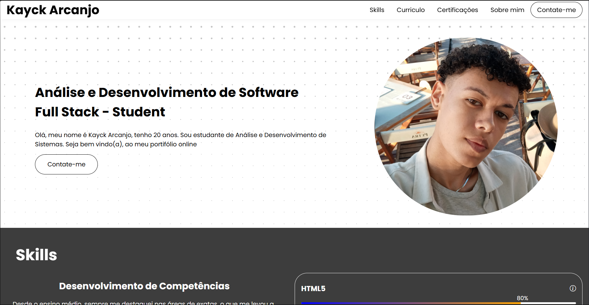

<h1>Olá, mundo!</h2>

Olá seja, muito bem vindo(a) ao repositório da minha landing page!  
Este respositório foi criado com o intuito de botar em prática meus estudos com HTML e CSS, porém de uma forma mais aplicada.

<h2>Conheça mais sobre mim</h2>
<h3>Portifólio</h3>

    
    

Este portifólio é constituido por HTML, CSS e JavaScript.

Com o tempo vou aprendendo e acrescentando mais funcionalidades ao Repositório/Portifólio.

